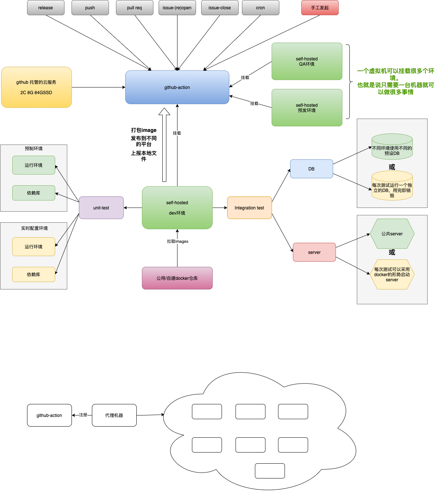
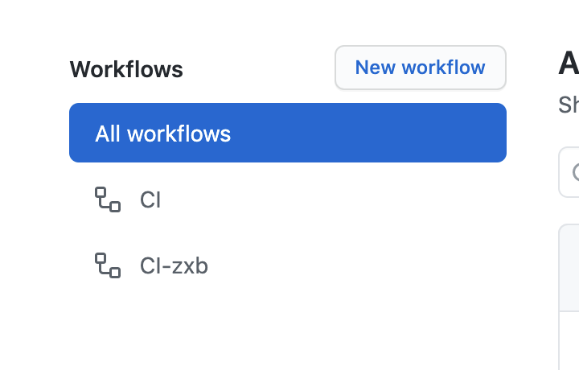
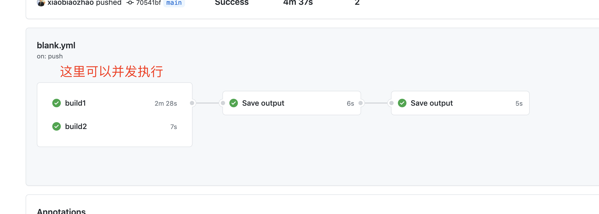
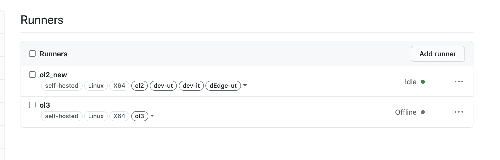
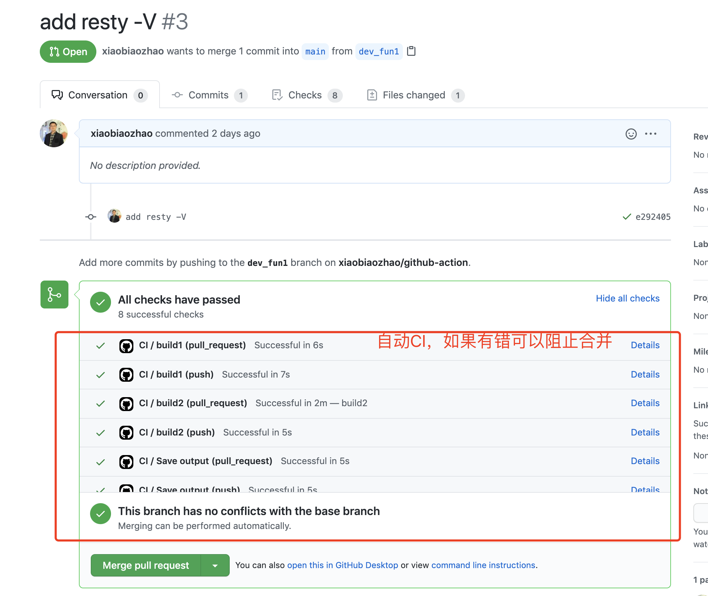
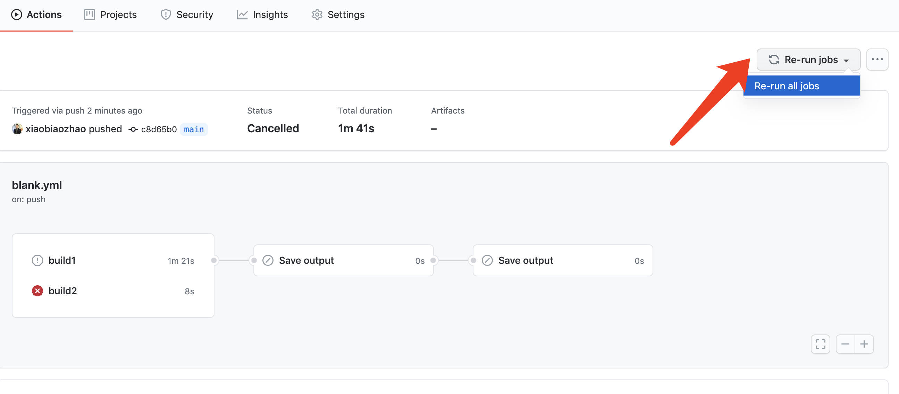
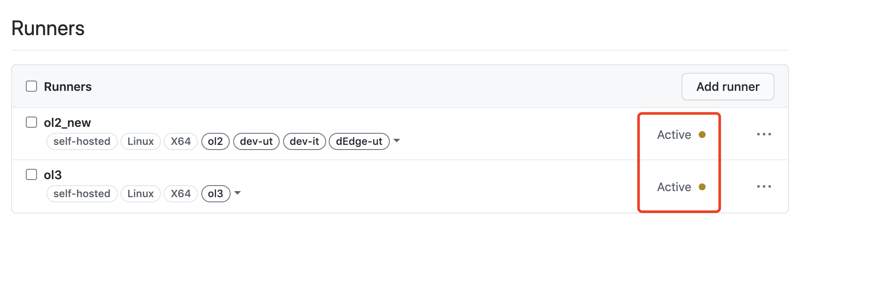
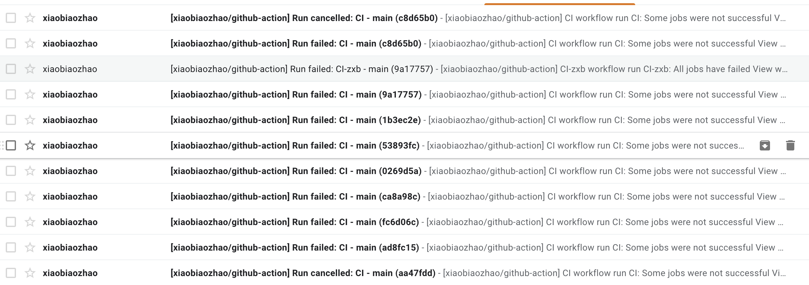
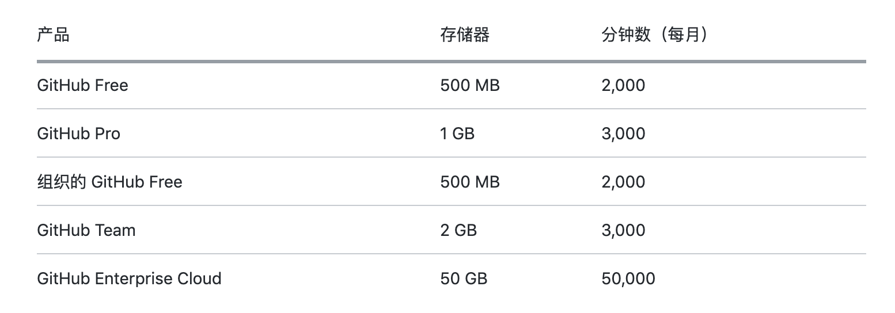

- [github action 调用](#github-action-调用)
  - [概念逻辑](#概念逻辑)
  - [运行架构](#运行架构)
  - [一些截图](#一些截图)
    - [可以根据不同的业务需求制定不同的workflow](#可以根据不同的业务需求制定不同的workflow)
    - [job 是可以并发执行的](#job-是可以并发执行的)
    - [runner 标签可以自由定制，并绑定到对应的host上。](#runner-标签可以自由定制并绑定到对应的host上)
  - [PR 自动运行CI](#pr-自动运行ci)
    - [重跑](#重跑)
  - [优缺点](#优缺点)
    - [优点](#优点)
    - [缺点](#缺点)
  - [费用](#费用)
  - [结论](#结论)
# github action 调用

## 概念逻辑

## 运行架构

## 一些截图

### 可以根据不同的业务需求制定不同的workflow

### job 是可以并发执行的

### runner 标签可以自由定制，并绑定到对应的host上。
**调度的基本单位是 job，同一workflow 的job可以跑在不同的host上。**

## PR 自动运行CI

### 重跑

## 优缺点
### 优点
1. 非常方便使用
2. 可做commit级别的CI
3. 任务调度、安排也非常方便

### 缺点
1. 需要迁移现有的CI

## 费用

https://docs.github.com/cn/github/setting-up-and-managing-billing-and-payments-on-github/about-billing-for-github-actions

## 结论
1. 使用方便可以与我们现有的github做无缝衔接，UI体验佳
1. 单元测试一定没有问题
2. 集成测试也可以运行，不过如果是需要运行不同的环境最好给不同的环境准备不同的host机器。
3. host机器可以随时挂载，如果挂载成功了则可以立马监听job，如果当前没有可用机器，则github可以等待有合适的host挂载成功后再调度job